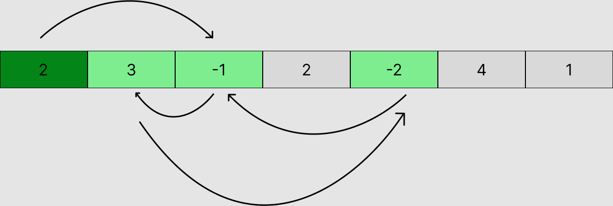
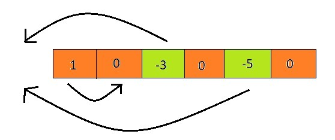

# <a href="https://practice.geeksforgeeks.org/problems/e2d156755ca4e0a9b9abf5680191d4b06e52b1a8/1">Good Stones</a>

## Approach 1 : C++ | DP | O(N)

## Explaination :
<!-- ## 1. We will traverse from n-1 th index to 0 th index & check wheather the arr[index] along with index will lead to cycle or not.It will take O(N) time. -->

##  How To Determine Cycle or BAD index? There are two possibilities :
###  i. If arr[index]=0 then it is a cycle.
###  ii. If index is not visited we do visited[index]=1 then,
- after doing (index+arr[index]=>so on )it comes back to itself & find itself visited or such a index that already a bad index then it will consider itself as bad & return back to all such idx from where was called and make them as bad index.

## How to know if an index is GOOD ? There are also two possibilities :
###  i. Eiter it's index+arr[index]>n-1 leads to out of array index i.e <0 or >n-1.
###  ii. Or it reaches to such index that is a good one.

## Time Complexity : O(N)

+ At the worst condition it may happen that, there is an index for which we recursively called all n elements. Now ultimately we will get an ans for that. As we have traversed all n elements now we know their validity[(good)true/(bad)false].
+ So now for rest of the iteration we will simply be able to check validity in O(1).  
### Therefore ultimately it will be : O(N).
### Example 1:


```
Input: [2, 3, -1, 2, -2, 4, 1]
Output: 3
Explanation: Index 3, 5 and 6 are safe only. As index 1, 4, 2 forms a cycle and from index 0 you can go to index 2 which is part of cycle.
```
### Example 2:


```
Input: [1, 0, -3, 0, -5, 0]
Output: 2
Explanation: Index 2 and 4 are safe only. As index 0, 1, 3, 5 form cycle.
```
```
class Solution{
public:
vector<int>visited;
vector<bool>valid;

    bool is_valid(int idx,vector<int>&arr,int n)
    {
        int index=idx+arr[idx];
        visited[idx]=1;
        
        if(index<0 || index>n-1)
        {
            valid[idx]=true;
            return true;
        }
        else if(arr[idx]==0)
        {
            valid[idx]=false;
            return false;
        }
        else
        {
            if(visited[index]!=-1)
            {
                valid[idx]=valid[index];
                return valid[idx]==1;
            }
            else
            {
                valid[idx]=is_valid(index,arr,n);
            }
        }
        return valid[idx]==true;
    }
    int goodStones(int n,vector<int> &arr){
        visited=vector<int>(n,-1);
        valid=vector<bool>(n,false);
        int cnt=0;
        for(int i=n-1;i>=0;i--)
        {
            if(arr[i]==0)
            {
                visited[i]=1;
                valid[i]=false;
                continue;
            }
            if(visited[i]==-1)
            {
                if(is_valid(i,arr,n))
                {
                    cnt++;
                    valid[i]=true;
                }
                else
                {
                    valid[i]=false;
                }
            }
            else
            {
                if(valid[i]==true)
                {
                    cnt++;
                }
            }
        }
        return cnt;
    }  
};
```