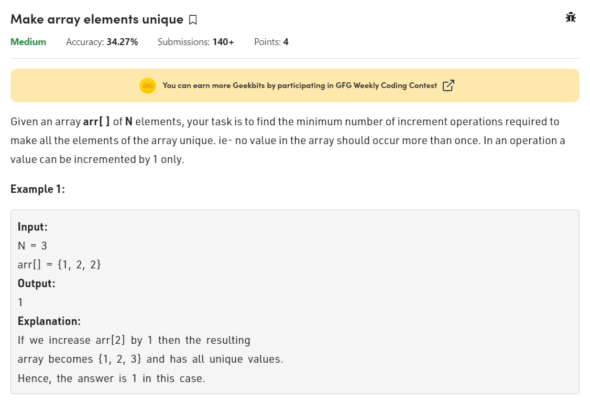

# GFG POTD :11-01-2023 :Make array elements unique



# Approach 1: Brute Force : by sorting
```
class Solution {
  public:
    long long int minIncrements(vector<int> arr, int N) {
        // Code here
        long long int ans=0;
        sort(arr.begin(),arr.end());
        for(int i=1;i<N;i++)
        {
            if(arr[i]<=arr[i-1])
            {
                int t=(abs(arr[i-1]-arr[i])+1);
                ans+=t;
                arr[i]=arr[i]+t;
            }
        }
        return ans;
    }
};
```
-Problem Link:(https://practice.geeksforgeeks.org/problems/6e63df6d2ebdf6408a9b364128bb1123b5b13450/1)