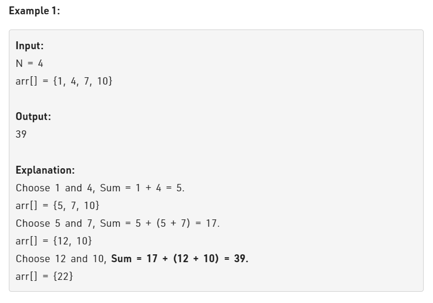

# GFG POTD :12-01-2023 :Minimize the sum




-  Constraints :  1 <= N, arr[i] <= 105

## Approach 1: Using Priority Queue (Min-Heap)
```
class Solution {
public:
    int minimizeSum(int N, vector<int> arr) {
        // code here
        priority_queue<int,vector<int>,greater<int>>pq; //Syntax for min-heap
        //We will push the whole arr in the min-heap
        for(int i=0;i<N;i++)
        {
            pq.push(arr[i]);
        }
        int ans=0;
        //keep popping two elements & pushing their sum while there are more 1 elements. 
        while(pq.size()>=2)
        {
            int t1=pq.top();
            pq.pop();
            int t2=pq.top();
            pq.pop();
            ans+=(t1+t2);
            pq.push(t1+t2);
        }
        return ans;
    }
};
```
### Time Complexity :O(N*logN) ,
insertion time complexity of priority-queue / Heap is O(N*log N).As i have inserted all N elements in Priority Queue,Therefore T.C :O(N*log N).
### Space Complexity :O(N)  ,
have taken auxilairy space of O(N),as N elements are put in the stack. 