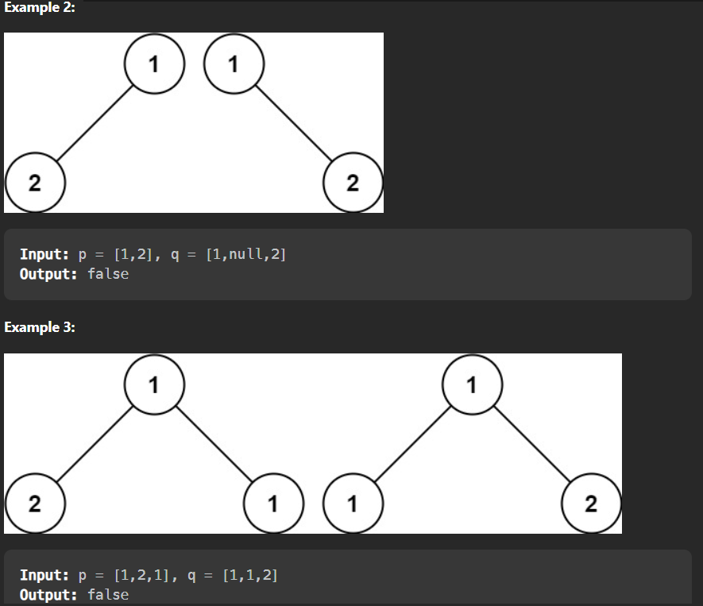

# 100.Same Tree Problem Description
<!--  -->
<!--  -->
<!--  -->


- Constraints:

The number of nodes in both trees is in the range [0, 100].
-104 <= Node.val <= 104.

## Brute Force Approach 1:
```
/**
 * Definition for a binary tree node.
 * struct TreeNode {
 *     int val;
 *     TreeNode *left;
 *     TreeNode *right;
 *     TreeNode() : val(0), left(nullptr), right(nullptr) {}
 *     TreeNode(int x) : val(x), left(nullptr), right(nullptr) {}
 *     TreeNode(int x, TreeNode *left, TreeNode *right) : val(x), left(left), right(right) {}
 * };
 */


class Solution {
public:
    //  vector<int>v;
    void helper(TreeNode* root,vector<int>&v)
    {
        if(root==NULL)
        {
            v.push_back(-10001);
            return;
        }
        v.push_back(root->val);
        helper(root->left,v);
        helper(root->right,v);
    }
    bool isSameTree(TreeNode* p, TreeNode* q) {
         vector<int>v1,v2,v;
        helper(p,v);
        v1=v;
        v={};
        helper(q,v);
        v2=v;
        return v1==v2;
    }
};
```
## Optimized Approach 2:
```
class Solution {
public:
bool helper(TreeNode* p, TreeNode* q)
{
    if(p==NULL && q==NULL) return true;
    else if(p==NULL || q==NULL) return false;
    else if(p->val!=q->val) return false;
    return (helper(p->left,q->left)&&helper(p->right,q->right));
}
    bool isSameTree(TreeNode* p, TreeNode* q) {
        return helper(p,q);
    }
};

```
- Problem Link :https://leetcode.com/problems/same-tree/