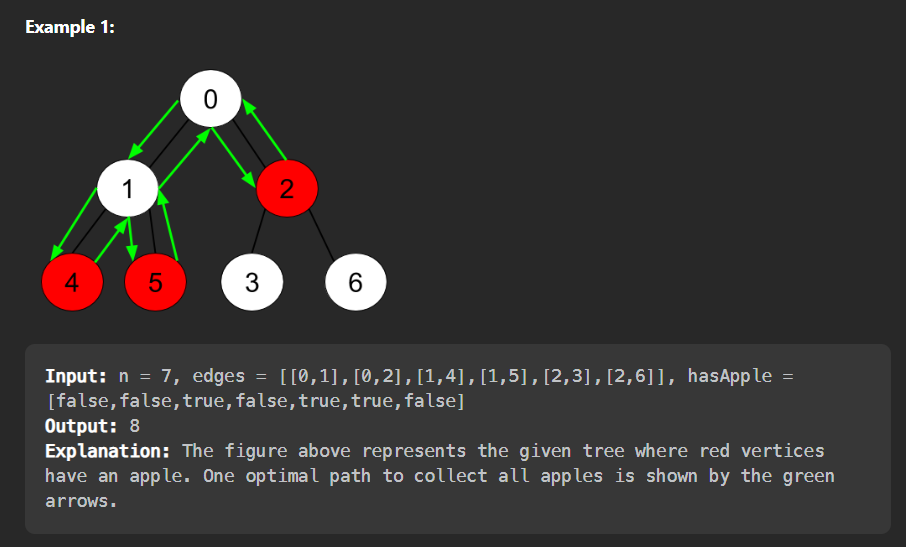

# 1443. Minimum Time to Collect All Apples in a Tree



- Constraints:

- 1 <= n <= 105
- edges.length == n - 1
- edges[i].length == 2
- 0 <= ai < bi <= n - 1 from i < to i
- hasApple.length == n

## Approach 1:Using DFS
```
class Solution {
public:

    int valid_edges;
    int dfs(vector<int>adj[],int n,vector<bool>&hasApple,int vertex,vector<int>&visited)
    {
        visited[vertex]=1;
        int l=0;
        for(int i=0;i<adj[vertex].size();i++)
        {
            if(visited[adj[vertex][i]]==-1)
            {
                l+=dfs(adj,n,hasApple,adj[vertex][i],visited);
            }
        }
        /*for each node/vertex we will add the no. of valid_edges it has.*/
        valid_edges+=l;
        /*if this vertex has apple then it's we have to make the path valid through it came.*/
        if(l!=0 || hasApple[vertex]==true)
        {
            l=1;
        }
        return l;
    }
    int minTime(int n, vector<vector<int>>& edges, vector<bool>& hasApple) {
        vector<int>adj[n];
        valid_edges=0;
        for(int i=0;i<edges.size();i++)
        {
            adj[edges[i][0]].push_back(edges[i][1]);
            adj[edges[i][1]].push_back(edges[i][0]);
        }
        vector<int>visited(n,-1);
        dfs(adj,n,hasApple,0,visited);
        /*for traversing each valid edge we need to spend 
           2 secons of time.Therefore valid_edges*2*/
        return valid_edges*2; 
    }
};


```
### Time Complexity :O(V+E)  ,
- where V=no. of vertices & E=no. of edges,as we have implemented dfs here.
### Space Complexity :O(N)
- As we are creating an adjacency list including all n elements.Therefore n auxiliary space is taken.
