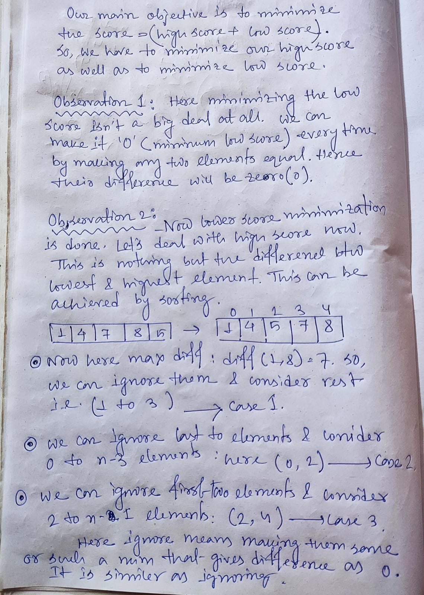

# <a href="https://leetcode.com/problems/minimum-score-by-changing-two-elements/">6361. Minimum Score by Changing Two Elements</a>

# Approach 1 : Sort | O(NlogN)




```
class Solution {
public:
    int minimizeSum(vector<int>& nums) {
        sort(nums.begin(),nums.end());
        
        int min_sum=INT_MAX;
        int n=nums.size();

        int diff1=abs(nums[2]-nums[n-1]);
        int diff2=abs(nums[1]-nums[n-2]);
        int diff3=abs(nums[0]-nums[n-3]);
        
        min_sum=min(diff1,min(diff2,diff3));
        return min_sum;
    }
};
```
## Time Complexity : O(Nlog N)
Sorting takes O(NlogN) time.Hence nlogn.